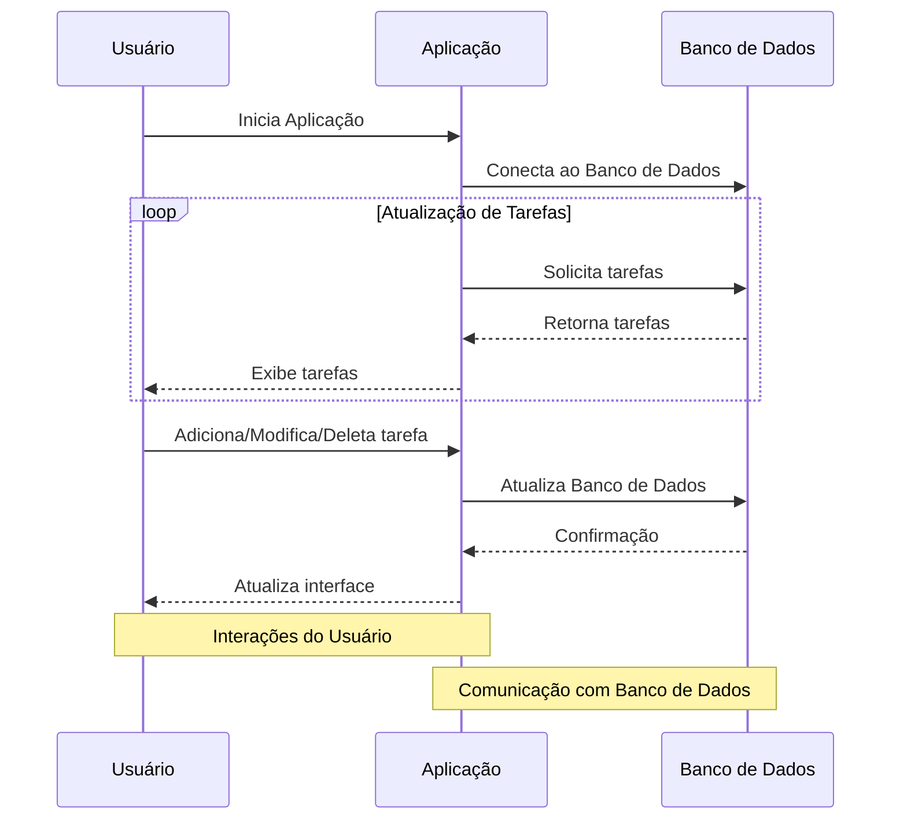

# Documentação Técnica: Aplicativo de Lista de Tarefas com Tkinter e PostgreSQL

## Visão Geral

O aplicativo de Lista de Tarefas é uma interface gráfica de usuário (GUI) desenvolvida em Python utilizando Tkinter e PostgreSQL. O aplicativo permite aos usuários adicionar, visualizar, editar e excluir tarefas de uma lista. Cada tarefa tem atributos como nome, data de vencimento, prioridade e status de conclusão.

## Requisitos

- Python 3.x
- Bibliotecas: `tkinter`, `psycopg2`
- PostgreSQL

## Estrutura da Tabela no PostgreSQL

```sql
CREATE TABLE todo_list (
  id SERIAL PRIMARY KEY,
  task_name VARCHAR(255) NOT NULL,
  due_date DATE,
  priority INT,
  completed BOOLEAN DEFAULT false
);
```

## Classe `TaskApp`

### Métodos

- `__init__(self, master=None)`: Inicializa a aplicação, cria a conexão com o banco de dados e os widgets.
- `create_widgets(self)`: Cria e posiciona os widgets na janela.
- `show_task_info(self, event)`: Mostra informações detalhadas da tarefa selecionada.
- `refresh_list(self)`: Atualiza a lista de tarefas.
- `add_task(self)`: Adiciona uma nova tarefa ao banco de dados ou atualiza uma tarefa existente.
- `edit_task(self)`: Prepara a edição de uma tarefa selecionada.
- `delete_task(self)`: Deleta a tarefa selecionada do banco de dados.

### Atributos

- `master`: Janela principal do Tkinter.
- `conn`: Conexão com o banco de dados PostgreSQL.
- `cursor`: Cursor para execução de comandos SQL.
- Widgets diversos (ex.: `task_label`, `task_entry`, `add_button`).

## Função `run_app()`

Inicia a aplicação criando uma instância de `TaskApp` e entra no loop principal do Tkinter.

## Instruções de Uso

1. **Iniciar a Aplicação**: Execute o script Python para iniciar a aplicação.
2. **Adicionar Tarefa**: Preencha os campos de tarefa, data de vencimento e prioridade. Clique em "Adicionar Tarefa".
3. **Visualizar Tarefas**: As tarefas são exibidas na lista principal.
4. **Editar Tarefa**: Selecione uma tarefa e clique em "Editar Tarefa". Modifique os campos desejados e clique em "Salvar alteração".
5. **Excluir Tarefa**: Selecione uma tarefa e clique em "Apagar Tarefa".
6. **Informações da Tarefa**: Dê um duplo clique em uma tarefa para ver detalhes.

## Segurança e Melhorias

- **Segurança**: O código contém credenciais de banco de dados expostas, o que é uma prática insegura. Recomenda-se o uso de variáveis de ambiente ou arquivos de configuração.
- **Validação de Dados**: Adicionar validação para os campos de entrada para evitar dados inválidos ou incompletos.
- **Melhorias na UI**: Pode-se melhorar a interface gráfica para torná-la mais intuitiva e responsiva.

## Arquitetura em Camadas

# Processos Referentes à Arquitetura em Camadas do Aplicativo de Lista de Tarefas

A arquitetura em camadas é um modelo de design que ajuda a separar as responsabilidades e funcionalidades de um aplicativo em diferentes níveis ou "camadas". Para o aplicativo de Lista de Tarefas desenvolvido com Tkinter e PostgreSQL, podemos definir a seguinte estrutura de arquitetura em camadas:

## 1. Camada de Apresentação (Front-End)

### Responsabilidades:

- **Interface Gráfica do Usuário (GUI)**: Desenvolver e manter a interface com a qual o usuário interage. Inclui a criação de janelas, botões, campos de entrada de texto, listas e outros elementos gráficos.
- **Interatividade**: Gerenciar a interação do usuário com a interface, como cliques em botões, entradas de texto e seleção de itens da lista.
- **Exibição de Dados**: Mostrar informações ao usuário, como a lista de tarefas, detalhes da tarefa e mensagens de erro ou sucesso.

### Tecnologias Utilizadas:

- Tkinter para a construção da interface gráfica.

## 2. Camada de Lógica de Negócios (Back-End)

### Responsabilidades:

- **Processamento de Dados**: Implementar a lógica necessária para processar as ações do usuário, como adicionar, editar, excluir e visualizar tarefas.
- **Validação**: Verificar a validade dos dados fornecidos pelo usuário antes de enviá-los para a camada de dados.
- **Manipulação de Estados**: Gerenciar o estado das tarefas (por exemplo, concluído ou não concluído).

### Tecnologias Utilizadas:

- Python para a implementação da lógica de negócios.

## 3. Camada de Dados (Banco de Dados)

### Responsabilidades:

- **Persistência de Dados**: Armazenar e recuperar dados relacionados às tarefas, como nome, data de vencimento, prioridade e status.
- **Gerenciamento de Banco de Dados**: Criar, ler, atualizar e deletar registros no banco de dados (CRUD).
- **Segurança de Dados**: Garantir a segurança dos dados, protegendo-os contra acesso não autorizado ou corrupção.

### Tecnologias Utilizadas:

- PostgreSQL para o sistema de gerenciamento de banco de dados.

## Processos de Integração entre as Camadas

1. **Comunicação entre Camada de Apresentação e Lógica de Negócios**: Quando o usuário realiza uma ação na GUI (por exemplo, adiciona uma nova tarefa), a camada de apresentação envia esses dados para a camada de lógica de negócios.

2. **Processamento na Camada de Lógica de Negócios**: A lógica de negócios processa a solicitação (validando dados, aplicando regras de negócio) e interage com a camada de dados para persistir ou recuperar informações.

3. **Operações na Camada de Dados**: A camada de dados executa as operações de banco de dados necessárias e retorna os resultados para a camada de lógica de negócios.

4. **Resposta à Camada de Apresentação**: A camada de lógica de negócios envia os resultados de volta para a camada de apresentação, que atualiza a GUI de acordo.


### Camada de Interface Gráfica

Esta camada é responsável por toda a interação com o usuário, utilizando a biblioteca `tkinter`. Os elementos gráficos, como rótulos, caixas de entrada e botões, são definidos nesta camada.

#### Recursos:
- Labels (rótulos) para exibição de informações.
- Entry (caixas de entrada) para entrada de dados.
- Buttons (botões) para acionar ações.
- Listbox para exibição da lista de tarefas.

#### Principais Processos:
- **create_widgets():** Criação dos elementos gráficos.
- **show_task_info(event):** Exibe informações detalhadas de uma tarefa selecionada.
- **refresh_list():** Atualiza a lista de tarefas na interface.

### Camada de Lógica de Negócios

Nesta camada, estão as funções relacionadas à lógica da aplicação, como adicionar, editar, excluir e visualizar tarefas. Além disso, há a lógica para limpar campos de entrada, obter dados do banco de dados e atualizar a lista de tarefas.

#### Recursos:
- Funções para adicionar, editar, excluir e visualizar tarefas.
- Funções auxiliares para limpar campos de entrada e obter dados do banco de dados.

#### Principais Processos:
- **add_task():** Adiciona uma nova tarefa ou edita uma existente.
- **edit_task():** Permite a edição de uma tarefa existente.
- **delete_task():** Exclui uma tarefa selecionada.

### Camada de Acesso ao Banco de Dados

Nesta camada, ocorre a interação com o banco de dados PostgreSQL do Supabase. São realizadas operações como inserção, atualização, exclusão e consulta de dados.

#### Recursos:
- Conexão com o banco de dados.
- Execução de consultas SQL.

#### Principais Processos:
- **refresh_list():** Obtém a lista de tarefas do banco de dados e atualiza a interface.
- **add_task():** Adiciona ou atualiza uma tarefa no banco de dados.
- **edit_task():** Obtém os dados de uma tarefa do banco de dados para edição.
- **delete_task():** Exclui uma tarefa do banco de dados.


# Estratégias para Escalabilidade e Refatoração do Aplicativo de Lista de Tarefas

## Escalabilidade

A escalabilidade de um aplicativo refere-se à sua capacidade de lidar com o crescimento, seja em termos de volume de dados, número de usuários ou complexidade das operações. Para o aplicativo de Lista de Tarefas, várias estratégias podem ser adotadas:

1. **Modularização do Código**: Separar o código em módulos ou classes específicas para diferentes funcionalidades. Isso não só torna o código mais gerenciável, mas também facilita a adição de novas funcionalidades.

2. **Uso de ORM (Object-Relational Mapping)**: Introduzir um ORM, como SQLAlchemy para Python, pode simplificar a interação com o banco de dados e tornar o código mais adaptável a mudanças.

3. **Serviços de Cache**: Implementar caching para reduzir o tempo de resposta e a carga sobre o banco de dados, especialmente para operações de leitura frequentes.

4. **Escalabilidade Horizontal do Banco de Dados**: Preparar o banco de dados para ser escalável horizontalmente (por exemplo, usando sharding ou replicação) para lidar com um aumento no volume de dados.

5. **Adoção de Microserviços**: Se a aplicação se tornar muito grande, considerar a arquitetura de microserviços, onde diferentes funcionalidades são geridas por serviços independentes.

## Refatoração

Refatoração é o processo de reestruturar o código existente sem alterar seu comportamento externo, com o objetivo de melhorar a legibilidade, reduzir a complexidade e facilitar a manutenção.

1. **Padrões de Projeto**: Adotar padrões de projeto como MVC (Model-View-Controller) para melhor separação entre a lógica de negócios, a interface do usuário e a interação com o banco de dados.

2. **Melhoria da Estrutura de Dados**: Avaliar e, se necessário, refatorar a estrutura de dados usada para melhorar o desempenho e a eficiência.

3. **Otimização de Consultas SQL**: Revisar e otimizar as consultas SQL para melhorar a performance com o banco de dados.

4. **Uso de Funções e Métodos Genéricos**: Substituir código duplicado por funções ou métodos genéricos para reduzir a redundância e facilitar futuras alterações.

5. **Testes Automatizados**: Implementar testes automatizados para garantir que as refatorações não quebrem funcionalidades existentes.

6. **Documentação do Código**: Melhorar a documentação interna do código para facilitar o entendimento e a manutenção por outros desenvolvedores.

7. **Revisão da Interface Gráfica**: Avaliar a interface gráfica do usuário (GUI) para melhorar a usabilidade e a experiência do usuário, o que pode incluir a reorganização de elementos ou a implementação de novos componentes visuais.


## Diagramas

### Diagrama de Atividade

### Diagrama de Máquina de Estados


### Diagrama de Sequência



### Diagrama de Caso de Uso


